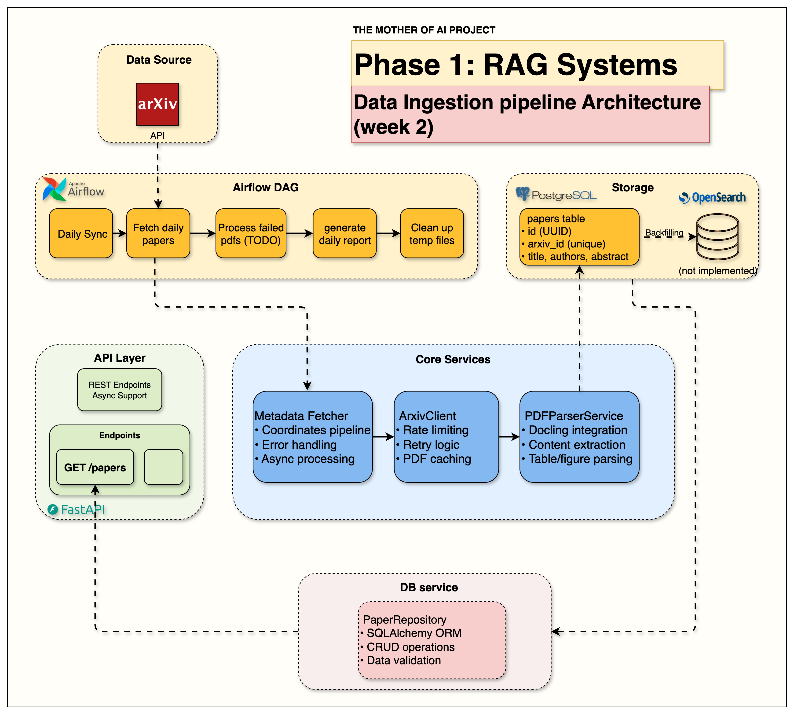

# Week 2 — Data Ingestion Pipeline: Getting Papers Into the System

> **One-line summary:** Build a pipeline that fetches new cs.AI papers from arXiv every weekday, downloads and parses their PDFs with Docling, and stores metadata plus full text in PostgreSQL. Airflow orchestrates it.

**Tag:** `week2.0` · **Notebook:** `notebooks/week2/week2_arxiv_integration.ipynb` · **Original blog:** [Building Data Ingestion Pipelines for RAG](https://jamwithai.substack.com/p/bringing-your-rag-system-to-life)



---

## 1. Why this week matters

A RAG system can only retrieve what's in its store. Most RAG tutorials start from a folder of clean text files. Real systems have to:

- talk to an external API that rate-limits you and sometimes times out,
- download large binary files that may be corrupt or huge,
- turn PDFs (two-column layouts, equations, tables) into usable text,
- keep working when 10–20% of items fail,
- run on a schedule without anyone watching.

Week 2 is ordinary data engineering, and it decides the quality of everything after it. If the parsed text is bad, the chunks are bad, and so are the embeddings and the answers.

---

## 2. What you build

| Component | File | Responsibility |
|-----------|------|----------------|
| `ArxivClient` | [src/services/arxiv/client.py](../src/services/arxiv/client.py) | Query the arXiv Atom API, parse XML, rate-limit, download PDFs with retries and a local cache |
| `DoclingParser` / `PDFParserService` | [src/services/pdf_parser/docling.py](../src/services/pdf_parser/docling.py), [parser.py](../src/services/pdf_parser/parser.py) | Validate PDFs, extract sections + raw text |
| `MetadataFetcher` | [src/services/metadata_fetcher.py](../src/services/metadata_fetcher.py) | Orchestrator: fetch → download+parse (concurrently) → store |
| `Paper` model | [src/models/paper.py](../src/models/paper.py) | SQLAlchemy table `papers` |
| `PaperRepository` | [src/repositories/paper.py](../src/repositories/paper.py) | DB access, including `upsert` by `arxiv_id` |
| Pydantic schemas | [src/schemas/arxiv/paper.py](../src/schemas/arxiv/paper.py), [src/schemas/pdf_parser/models.py](../src/schemas/pdf_parser/models.py) | `ArxivPaper`, `PaperCreate`, `PdfContent`, `ParsedPaper` |
| Airflow DAG | [airflow/dags/arxiv_paper_ingestion.py](../airflow/dags/arxiv_paper_ingestion.py) + [airflow/dags/arxiv_ingestion/](../airflow/dags/arxiv_ingestion/) | Scheduled, retried, observable execution |
| Factories | `src/services/*/factory.py` | `make_arxiv_client()`, `make_pdf_parser_service()`, `make_metadata_fetcher()` build services from settings |

---

## 3. The data flow

```
                 ┌──────────────── MetadataFetcher.fetch_and_process_papers() ────────────────┐
                 │                                                                            │
 arXiv API ──► Step 1: fetch_papers()  ──► List[ArxivPaper]                                   │
 (Atom XML)      │   cat:cs.AI AND submittedDate:[YYYYMMDD0000+TO+YYYYMMDD2359]               │
                 │                                                                            │
                 │  Step 2: _process_pdfs_batch()  (one pipeline task per paper)              │
                 │     ┌── download_semaphore (5) ──► download_pdf() ──► data/arxiv_pdfs/ID.pdf│
                 │     └── parse_semaphore    (1) ──► parse_pdf()    ──► PdfContent           │
                 │                                                                            │
                 │  Step 3: _store_papers_to_db() ──► PaperRepository.upsert() ──► PostgreSQL │
                 └────────────────────────────────────────────────────────────────────────────┘
```

---

## 4. Concepts and code walkthrough

### 4.1 The arXiv API

arXiv returns **Atom XML**, not JSON. One request looks like:

```
https://export.arxiv.org/api/query?search_query=cat:cs.AI AND submittedDate:[202508070000+TO+202508072359]
                                  &start=0&max_results=15&sortBy=submittedDate&sortOrder=descending
```

What the client does ([client.py:56-134](../src/services/arxiv/client.py#L56-L134)):

- **Query syntax.** `cat:` filters by category, `submittedDate:[FROM+TO+TO]` takes `YYYYMMDDHHMM` timestamps. The client appends `0000` / `2359` to cover the whole day.
- **URL encoding.** `urlencode(..., quote_via=quote, safe=":+[]")` stops `:`, `+`, `[`, `]` from being percent-encoded. arXiv's parser needs them literal, and standard encoding breaks the date filter. This is easy to get wrong.
- **Rate limiting.** arXiv asks for ≥3 seconds between requests. The client stores `_last_request_time` and `asyncio.sleep`s for the remaining gap. It's a minimal "polite client" pattern.
- **Hard cap.** `min(max_results, 2000)`, the API's own limit per call.
- **XML parsing.** `ElementTree` with an Atom namespace map. Each `<entry>` becomes an `ArxivPaper`. A malformed entry returns `None` and is skipped, so one bad entry doesn't fail the batch.
- **Typed errors.** `ArxivAPITimeoutError`, `ArxivAPIException` and `ArxivParseError` (from [src/exceptions.py](../src/exceptions.py)) let callers react to *what* failed.

### 4.2 Downloading PDFs: caching and retries

[client.py:405-493](../src/services/arxiv/client.py#L405-L493)

- **Cache first.** If `data/arxiv_pdfs/<id>.pdf` exists and `force_download=False`, it's reused. Re-running the pipeline is cheap and idempotent.
- **Streaming download.** `client.stream("GET", url)` + `aiter_bytes()` writes to disk in chunks, so a 20 MB PDF never sits fully in memory.
- **Retries with backoff.** Wait is `download_retry_delay_base * (attempt + 1)` → 5s, 10s, 15s. The comment says "exponential" but this is **linear** backoff. Exponential would be `base * 2**attempt`, ideally with random jitter.
- **Cleanup.** Partial files are deleted when every retry fails.

### 4.3 Parsing PDFs with Docling

[docling.py](../src/services/pdf_parser/docling.py)

Docling (from IBM) runs layout models over the PDF and labels each text element: `title`, `section_header`, paragraph, and so on. It handles two-column layouts much better than plain text extraction (e.g. `pypdf`).

**Validate before you parse** (`_validate_pdf`). Cheap checks come before the expensive one:

| Check | Why |
|-------|-----|
| File size > 0 | Catches failed or partial downloads |
| Size ≤ `PDF_PARSER__MAX_FILE_SIZE_MB` (20) | Huge PDFs blow up memory |
| Starts with `%PDF-` | Catches HTML error pages saved as `.pdf` |
| Pages ≤ `PDF_PARSER__MAX_PAGES` (30), counted with `pypdfium2` | Long theses or books take minutes to parse |

Too-large or too-long PDFs make `parse_pdf` return **`None`**: the paper is skipped and stored as metadata only. A corrupt file raises an error. That's a deliberate split between "expected skip" and "real failure".

**Section extraction** is a simple state machine over `doc.texts`:

```python
for element in doc.texts:
    if element.label in ["title", "section_header"]:
        # close the current section, open a new one
    else:
        current_section["content"] += element.text + "\n"
```

The output is `PdfContent(sections=[PaperSection(title, content), ...], raw_text=doc.export_to_text(), ...)`. In Week 4 these **sections** become the main input to the chunker, so this loop matters a lot later.

**Pipeline options:** `do_ocr=False`, because arXiv PDFs are born-digital and OCR is very slow; `do_table_structure=True`.

### 4.4 The orchestrator: `MetadataFetcher`

[metadata_fetcher.py](../src/services/metadata_fetcher.py)

The most useful pattern here is **overlapping download and parse with two semaphores**:

```python
download_semaphore = asyncio.Semaphore(self.max_concurrent_downloads)   # 5
parse_semaphore    = asyncio.Semaphore(self.max_concurrent_parsing)     # 1 (from .env)

async def _download_and_parse_pipeline(paper, ...):
    async with download_semaphore:
        pdf_path = await self.arxiv_client.download_pdf(paper)
    async with parse_semaphore:          # download slot is released before parsing starts
        pdf_content = await self.pdf_parser.parse_pdf(pdf_path)

results = await asyncio.gather(*tasks, return_exceptions=True)
```

- Downloads are I/O-bound, so several run at once. Parsing is CPU and memory heavy, so `.env.example` limits it to **1**.
- `return_exceptions=True` means one failed paper doesn't cancel the others; failures are collected in `results["errors"]`.
- The result dict (`papers_fetched`, `pdfs_downloaded`, `pdfs_parsed`, `papers_stored`, `errors`, `processing_time`) is effectively the pipeline's metrics. Airflow passes it to the report task.

**Graceful degradation:** a paper whose PDF fails is still stored with `pdf_processed=False` and a note in `parser_metadata`. Its metadata is still useful, and you can re-process it later with `get_unprocessed_papers()`.

### 4.5 Storage: the `papers` table

[models/paper.py](../src/models/paper.py)

| Column group | Columns | Notes |
|--------------|---------|-------|
| Identity | `id` (UUID PK), `arxiv_id` (unique, indexed) | `arxiv_id` is the natural key used for upserts |
| arXiv metadata | `title`, `authors` (JSON), `abstract`, `categories` (JSON), `published_date`, `pdf_url` | Lists are stored as JSON |
| Parsed content | `raw_text`, `sections` (JSON), `references` (JSON) | Null if parsing failed |
| Processing state | `parser_used`, `parser_metadata`, `pdf_processed`, `pdf_processing_date` | Lets you query "what still needs work?" |
| Audit | `created_at`, `updated_at` | `created_at` is what the indexing task uses to find new papers |

**Upsert** ([repositories/paper.py:85-95](../src/repositories/paper.py#L85-L95)): look up by `arxiv_id`; update it if found, insert otherwise. Re-running the DAG for the same day doesn't create duplicates. This is **idempotency**, the most important property of a scheduled pipeline.

> Note: this is a read-then-write upsert, so two concurrent writers could race. PostgreSQL's `INSERT ... ON CONFLICT (arxiv_id) DO UPDATE` does it atomically in one statement. That's a good exercise.

### 4.6 Orchestration with Airflow

[arxiv_paper_ingestion.py](../airflow/dags/arxiv_paper_ingestion.py)

```python
schedule="0 6 * * 1-5"     # 06:00 UTC, Monday–Friday (arXiv announces on weekdays)
retries=2, retry_delay=timedelta(minutes=30)
max_active_runs=1          # never run two ingestions at once
catchup=False              # don't backfill every missed day on first deploy

setup_environment >> fetch_daily_papers >> index_papers_hybrid >> generate_daily_report >> cleanup_temp_files
```

(At `week2.0` the chain was shorter. The OpenSearch indexing task was added in Week 3 and became `index_papers_hybrid` in Week 4.)

Patterns to notice:

- **Thin DAG, fat services.** The task functions in `airflow/dags/arxiv_ingestion/` only wire services together. The logic lives in `src/` and is shared with the API. The Airflow container mounts `src/` and adds `/opt/airflow` to `sys.path` ([common.py](../airflow/dags/arxiv_ingestion/common.py)).
- **`@lru_cache(maxsize=1)` on `get_cached_services()`.** Services are built once per worker process. Docling loads ML models, so you don't want to rebuild it for every task.
- **Async inside a sync operator.** `PythonOperator` callables are sync, so `fetch_daily_papers` calls `asyncio.run(...)`.
- **XCom for task-to-task data.** `fetch_daily_papers` pushes `fetch_results`, and later tasks `xcom_pull` it. XCom is for *small* metadata like counts and IDs, never the papers themselves; those go through PostgreSQL.
- **"Yesterday" logic.** Each run fetches the previous day's submissions.

---

## 5. Hands-on

```bash
git checkout week2.0            # or stay on main and read the Gotchas first
docker compose down
docker compose up --build -d    # rebuild: new deps (docling) and new DAGs

# Airflow UI → http://localhost:8080 (credentials: airflow/simple_auth_manager_passwords.json.generated)
# Unpause "arxiv_paper_ingestion" and trigger it manually.

# Inspect what landed in Postgres
docker exec -it rag-postgres psql -U rag_user -d rag_db -c \
  "select arxiv_id, left(title,60), pdf_processed, length(raw_text) from papers order by created_at desc limit 10;"

# Try the arXiv API directly (note the literal + and [ ])
curl "https://export.arxiv.org/api/query?search_query=cat:cs.AI&max_results=2&sortBy=submittedDate"
```

Then work through the notebook: client → download → parse → store → end-to-end.

---

## 6. Design decisions and trade-offs

| Decision | Why | Cost |
|----------|-----|------|
| Store parsed text in PostgreSQL, not only in the search index | PostgreSQL is the source of truth, so you can rebuild or re-chunk the index any time without re-downloading PDFs | Some duplicated storage |
| Docling instead of a plain text extractor | Section structure, reading order in two-column layouts | Slow (seconds per paper), heavy dependency, ML models in the container |
| Skip PDFs > 30 pages / > 20 MB | Keeps daily runs predictable | Long papers lose their full text (metadata is still stored) |
| One category (`cs.AI`), 15 papers/day by default | Small enough to iterate on a laptop | Not a complete corpus; raise `ARXIV__MAX_RESULTS` once things work |
| Airflow instead of a cron script | Retries, history, UI, dependency graph, backfills | Another service to run (and it's memory-hungry) |

---

<a id="gotchas"></a>

## 7. Gotchas

1. **🔴 PDF parsing is broken on `main`.** Commit `1a7ab20` ("remove unnecessary async from parse_pdf") made `DoclingParser.parse_pdf` synchronous ([docling.py:91](../src/services/pdf_parser/docling.py#L91)), but `PDFParserService.parse_pdf` still does `result = await self.docling_parser.parse_pdf(pdf_path)` ([parser.py:33](../src/services/pdf_parser/parser.py#L33)). Awaiting a non-awaitable `PdfContent` raises `TypeError`. The generic `except` turns it into `PDFParsingException`, so **every paper is stored without `raw_text`/`sections`**. In Week 4 the chunker then has no text and indexes nothing.
   **Fix:** don't just delete the `await`. Docling is CPU-bound and synchronous, so calling it directly blocks the event loop and the "concurrent" pipeline becomes serial. Run it in a worker thread:
   ```python
   result = await asyncio.to_thread(self.docling_parser.parse_pdf, pdf_path)
   ```
2. **Airflow 3 and `execution_date`.** `fetch_daily_papers` reads `context.get("execution_date")`. Airflow 3 replaced that key with `logical_date`, so the code most likely always uses the `datetime.now() - 1 day` fallback. Normal daily runs still work, but manual backfills for older dates won't fetch the date you asked for.
3. **Monday runs fetch Sunday.** "Yesterday" on a Monday is Sunday, a quiet day for submissions. Expect small Monday batches.
4. **Rate limiting is per client instance.** `_last_request_time` lives on the object. Two `ArxivClient`s, or two Airflow workers, don't coordinate.
5. **The `/api/v1/papers` endpoints** in the top-level README existed at `week2.0` (`src/routers/papers.py`) but were removed on `main`.
6. **`docker compose up --build` is required** after switching tags. Old images won't have Docling or the new DAG code.

---

## 8. Success checklist

- [ ] `fetch_papers()` returns `ArxivPaper` objects for a date range
- [ ] PDFs appear in `data/arxiv_pdfs/` and a second run reuses them (log: "Using cached PDF")
- [ ] `parse_pdf()` returns sections with sensible titles (Introduction, Method, …)
- [ ] `papers` table has rows; most have `pdf_processed = true` and non-null `raw_text`
- [ ] Re-running for the same date doesn't create duplicates
- [ ] The Airflow DAG runs green end to end, and the report task's log shows the counts

---

## 9. Self-check questions

1. Why does the client mark `:+[]` as "safe" when URL-encoding the query?
2. What's the difference between a PDF that returns `None` from `parse_pdf` and one that raises? Why handle them differently?
3. Downloads have concurrency 5 but parsing has 1. Why not the same number?
4. What does `return_exceptions=True` change about `asyncio.gather`?
5. Why is `upsert` on `arxiv_id` essential for a scheduled pipeline? What does `max_active_runs=1` add?
6. Why should XCom carry counts and not the parsed papers?
7. If you decided next month to change chunk size, why wouldn't you need to re-download any PDFs?

---

## 10. What's next

The papers are now in PostgreSQL, but PostgreSQL isn't a search engine. **Week 3** indexes them in OpenSearch and builds BM25 keyword search, which every good retrieval system relies on.
