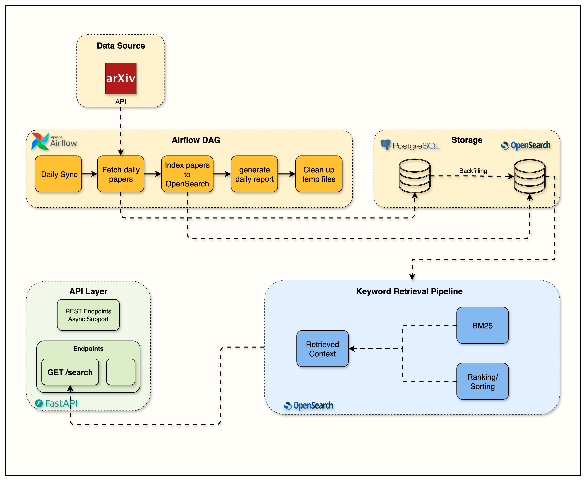

# Week 3 — Keyword Search First: The BM25 Foundation

> **One-line summary:** Index papers into OpenSearch with a well-designed mapping, then build a BM25 search API with field boosting, fuzzy matching, filters, highlighting and pagination, before touching vectors.

**Tag:** `week3.0` · **Notebook:** `notebooks/week3/week3_opensearch.ipynb` · **Original blog:** [The Search Foundation Every RAG System Needs](https://jamwithai.substack.com/p/the-search-foundation-every-rag-system)



> **Heads-up:** On `main`, the Week 3 paper-level index (`arxiv-papers`) and the `/api/v1/search` endpoint have been **replaced** by Week 4's chunk index and `/api/v1/hybrid-search`. The BM25 query logic (`QueryBuilder`) survived and is still used. Run `git checkout week3.0` to see Week 3 as released.

---

## 1. Why keyword search first?

Many RAG tutorials go straight to "embed everything, cosine similarity, done". In practice, keyword search does things vectors do badly:

| Query | BM25 | Pure vector search |
|-------|------|--------------------|
| `"LoRA"`, `"GPT-4o"`, `"2508.18563"` | Exact token match, top result | Embedding of a rare acronym is fuzzy and may return generic "fine-tuning" papers |
| `"Llama 3.1 405B"` | Every token is a strong signal | Numbers and version strings are nearly invisible to embeddings |
| *"Why was this result returned?"* | Explainable: matched terms, highlights, scores | A cosine score with no reason attached |
| Cost | No model, no GPU, milliseconds | Needs an embedding call per query and per document |

So: **build the keyword baseline first, measure it, and add semantics where it falls short** (Week 4). Hybrid systems in production work the same way.

---

## 2. What you build

| Component | File (at `week3.0`) | Responsibility |
|-----------|---------------------|----------------|
| Index mapping | `src/services/opensearch/index_config.py` | Schema + analyzers for the `arxiv-papers` index |
| `OpenSearchClient` | [src/services/opensearch/client.py](../src/services/opensearch/client.py) | Health, index creation, indexing, search |
| `QueryBuilder` | [src/services/opensearch/query_builder.py](../src/services/opensearch/query_builder.py) | Turns a request into OpenSearch Query DSL |
| Factory | [src/services/opensearch/factory.py](../src/services/opensearch/factory.py) | `make_opensearch_client()` from settings |
| Search router | `src/routers/search.py` | `POST /api/v1/search` |
| Dependency injection | [src/dependencies.py](../src/dependencies.py), [src/main.py](../src/main.py) | Client created once in `lifespan`, injected per request |
| Airflow task | `airflow/dags/arxiv_ingestion/` | New step: PostgreSQL → OpenSearch after fetching |

---

## 3. Concepts

### 3.1 Inverted index, analyzers, tokens

OpenSearch doesn't scan documents at query time. At index time, each `text` field goes through an **analyzer**, which splits it into tokens and normalizes them. The index then stores `token → [doc ids, positions, frequencies]`.

Week 3's custom analyzer:

```json
"text_analyzer": {
  "type": "custom",
  "tokenizer": "standard",
  "filter": ["lowercase", "stop", "snowball"]
}
```

`"Transformers are Learning Representations"` → standard tokenizer → `[Transformers, are, Learning, Representations]` → lowercase → stop-word removal (drops `are`) → snowball stemming → `[transform, learn, represent]`.

The **same analyzer runs on the query**, so a query for "learned transformer" matches. Seeing this is worth more than any explanation:

```bash
curl -s -X POST "localhost:9200/arxiv-papers-chunks/_analyze" -H 'Content-Type: application/json' \
  -d '{"analyzer": "text_analyzer", "text": "Transformers are Learning Representations"}' | jq '.tokens[].token'
```

### 3.2 BM25 in one paragraph

BM25 scores a document *D* for a query term *t* as:

```
score(t, D) = IDF(t) · tf·(k1+1) / ( tf + k1·(1 − b + b·|D|/avgdl) )
```

- **IDF**: rare terms count more. "diffusion" matters more than "model".
- **TF saturation (`k1`, default 1.2)**: the 10th occurrence of a term adds much less than the 2nd. Unlike TF-IDF, keyword stuffing doesn't keep paying off.
- **Length normalization (`b`, default 0.75)**: a match in a short field (a title) counts more than the same match in a long one (full text).

The query score is the sum over query terms. That's also why **field boosting** works: a title is short, so it already scores high per match, and `^3` amplifies it further.

### 3.3 The mapping: designing the schema

`week3.0:src/services/opensearch/index_config.py`:

```json
"mappings": {
  "dynamic": "strict",
  "properties": {
    "arxiv_id":   {"type": "keyword"},
    "title":      {"type": "text", "analyzer": "text_analyzer",
                   "fields": {"keyword": {"type": "keyword", "ignore_above": 256}}},
    "authors":    {"type": "text", "analyzer": "standard_analyzer", "fields": {"keyword": ...}},
    "abstract":   {"type": "text", "analyzer": "text_analyzer"},
    "raw_text":   {"type": "text", "analyzer": "text_analyzer"},
    "categories": {"type": "keyword"},
    "published_date": {"type": "date"},
    ...
  }
}
```

| Choice | Reason |
|--------|--------|
| `"dynamic": "strict"` | Unknown fields are **rejected**, not silently added. Typos fail loudly and the schema can't drift. |
| `text` vs `keyword` | `text` is analyzed for full-text search; `keyword` is stored as-is for exact match, filters, aggregations and sorting. `arxiv_id` and `categories` are identifiers, so they're `keyword`. |
| Multi-field `title.keyword` | One source field, two indexes: searchable *and* sortable/aggregatable. |
| Authors use the `standard` analyzer (no stemming) | Stemming names ("Jordan" → "jordan", "Mann" → "mann") doesn't help. |
| `number_of_replicas: 0` | Single-node dev cluster. A replica can't be placed on the same node, and the cluster would stay yellow. |

### 3.4 The query: `QueryBuilder`

[query_builder.py](../src/services/opensearch/query_builder.py) builds this (paper mode):

```json
{
  "query": {
    "bool": {
      "must":   [{ "multi_match": {
                    "query": "attention mechanism",
                    "fields": ["title^3", "abstract^2", "authors^1"],
                    "type": "best_fields",
                    "operator": "or",
                    "fuzziness": "AUTO",
                    "prefix_length": 2 }}],
      "filter": [{ "terms": { "categories": ["cs.AI", "cs.LG"] }}]
    }
  },
  "size": 10, "from": 0, "track_total_hits": true,
  "highlight": { "fields": { "abstract": { "fragment_size": 150, "number_of_fragments": 3,
                                            "pre_tags": ["<mark>"], "post_tags": ["</mark>"] } } }
}
```

What each piece does:

- **`bool.must` vs `bool.filter`.** `must` clauses contribute to the score. `filter` clauses only include or exclude documents, aren't scored, and are **cached** by OpenSearch. Category filters belong in `filter`, so they're fast and don't distort relevance.
- **`multi_match` + `best_fields`.** Searches several fields and takes the **best single field's** score per document. Alternatives: `most_fields` sums the fields (good when the same text is analyzed in different ways), `cross_fields` treats the fields as one big field (good for names split across first/last).
- **Boosts `^3 ^2 ^1`.** A hit in the title is a stronger signal than one in the abstract.
- **`operator: or`.** Any term can match, which favours recall. `and` would demand all terms, which favours precision.
- **`fuzziness: AUTO`, `prefix_length: 2`.** Typo tolerance: 0 edits for 1–2 character terms, 1 edit for 3–5, 2 edits for more. So **two-letter queries like `AI`, `ML`, `CV` stay exact**; you don't want `ML` to fuzzy-match `MD`. `prefix_length: 2` requires the first two characters to match, which avoids a fuzzy explosion.
- **Empty query → `match_all`, sorted by date.** A useful "latest papers" feed.
- **`latest_papers=True` → sort by `published_date desc`, then `_score`.**
- **Highlighting.** Returns matched snippets wrapped in `<mark>`, used later to show *why* something matched.

> On `main`, chunk mode switches the fields to `["chunk_text^3", "title^2", "abstract^1"]`. The same builder serves both modes.

### 3.5 Pagination

`size` + `from` is simple and fine for the first few pages. Deep pagination (`from=10000`) is expensive because every shard must collect `from+size` hits, so OpenSearch caps it. For deep scrolling you'd use `search_after`.

### 3.6 Wiring it into FastAPI: factory + lifespan + DI

```python
# main.py: create once at startup
@asynccontextmanager
async def lifespan(app):
    app.state.opensearch_client = make_opensearch_client()
    if app.state.opensearch_client.health_check():
        app.state.opensearch_client.setup_indices(force=False)
    yield

# dependencies.py: fetch per request
def get_opensearch_client(request: Request) -> OpenSearchClient:
    return request.app.state.opensearch_client
OpenSearchDep = Annotated[OpenSearchClient, Depends(get_opensearch_client)]

# router: just declare what you need
@router.post("/")
async def search_papers(request: SearchRequest, opensearch_client: OpenSearchDep): ...
```

Why bother:

- One HTTP connection pool, shared by all requests.
- Routers stay thin and **testable**: in tests you override the dependency with a fake client.
- Every service in later weeks (embeddings, Ollama, Redis, Langfuse, the agent) uses exactly this pattern.

Also note `_create_hybrid_index` handles `resource_already_exists_exception`. Several API workers can start at once, all see "index missing", and all try to create it. Handling that race is a small production detail.

---

## 4. Hands-on

```bash
git checkout week3.0 && docker compose up --build -d
cp .env.example .env     # OPENSEARCH__HOST=http://opensearch:9200, OPENSEARCH__INDEX_NAME=arxiv-papers

# Index health and document count
curl localhost:9200/_cluster/health?pretty
curl localhost:9200/arxiv-papers/_count

# Search through the API
curl -X POST localhost:8000/api/v1/search/ -H 'Content-Type: application/json' \
  -d '{"query": "reinforcement learning agents", "size": 5, "categories": ["cs.AI"]}'

# Newest papers, no query
curl -X POST localhost:8000/api/v1/search/ -H 'Content-Type: application/json' \
  -d '{"query": " ", "latest_papers": true}'
```

Then open OpenSearch Dashboards at http://localhost:5601 → Dev Tools, and run the raw query from section 3.4. Change one thing at a time (remove boosts, switch `operator` to `and`, set `fuzziness: 0`) and watch the ranking change.

---

## 5. Design decisions and trade-offs

| Decision | Trade-off |
|----------|-----------|
| Paper-level index (one doc = one paper) | Simple and good for "find papers", but a 10,000-word `raw_text` field dilutes BM25 and can't point to *where* in the paper the answer is. **This is why Week 4 moves to chunks.** |
| Fuzzy matching on by default | Catches typos, but can surface surprising matches on short technical terms; `prefix_length` limits that |
| `best_fields` | Good when one field should dominate; ignores evidence spread across fields |
| BM25 defaults (`k1=1.2, b=0.75`) | Rarely worth tuning before you have an evaluation set |

---

<a id="gotchas"></a>

## 6. Gotchas

1. **Strict mapping and new fields.** Add a field to the indexer without adding it to the mapping and bulk indexing **fails** for those docs. Changing a mapping usually means deleting and recreating the index (`setup_indices(force=True)`) and re-indexing from PostgreSQL. That's why PostgreSQL is the source of truth.
2. **Index-time and query-time analyzers must agree.** Stemming at index time with a different query analyzer means silent misses.
3. **The `/search` endpoint is gone on `main`.** Use `POST /api/v1/hybrid-search/` with `"use_hybrid": false` for pure BM25 on chunks.
4. **Cluster status `yellow`** on a single node usually means a replica can't be placed. `health_check()` treats yellow as healthy for this reason.

---

## 7. Success checklist

- [ ] `arxiv-papers` index exists with the strict mapping (`GET /arxiv-papers/_mapping`)
- [ ] Document count matches the number of papers in PostgreSQL
- [ ] `POST /api/v1/search/` returns ranked results with highlights
- [ ] Category filter narrows results without changing their relative order
- [ ] Two-letter queries (`AI`, `ML`, `NN`, `CV`) return sensible results
- [ ] The Airflow DAG now includes the OpenSearch indexing step and runs green

---

## 8. Self-check questions

1. What's the difference between a `text` and a `keyword` field? Which do you use for `categories`, and why?
2. Why are category filters in `bool.filter` and not `bool.must`?
3. With `fuzziness: AUTO`, how many edits are allowed for `ML`? For `transformer`?
4. Explain BM25's `k1` and `b` in your own words.
5. When would you choose `most_fields` or `cross_fields` over `best_fields`?
6. Why does the app create the OpenSearch client in `lifespan` instead of inside each request?
7. What's the main weakness of indexing whole papers as single documents?

---

## 9. What's next

BM25 on whole papers finds the right *paper* but not the right *paragraph*, and it misses paraphrases ("LLM" vs "large language model"). **Week 4** splits papers into section-aware chunks, embeds them, and fuses BM25 with vector search using Reciprocal Rank Fusion.
