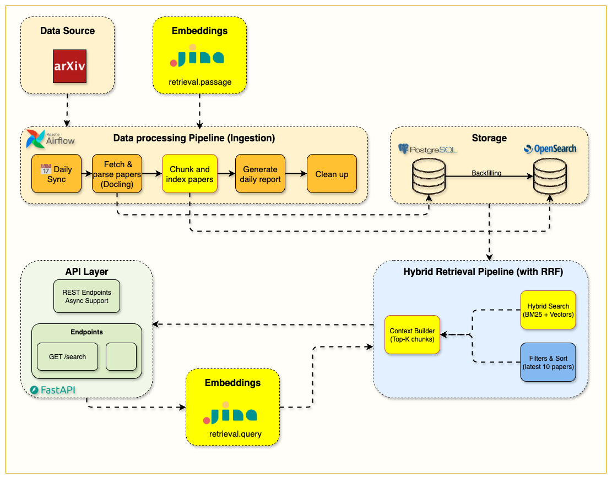

# Week 4 — Chunking and Hybrid Search: Adding the Semantic Layer

> **One-line summary:** Split each paper into section-aware chunks, embed them with Jina (1024-dim), store vectors and text in one OpenSearch index, and serve BM25, vector or **hybrid (RRF)** search from a single endpoint.

**Tag:** `week4.0` · **Notebook:** `notebooks/week4/week4_hybrid_search.ipynb` · **Original blog:** [The Chunking Strategy That Makes Hybrid Search Work](https://jamwithai.substack.com/p/chunking-strategies-and-hybrid-rag)



---

## 1. Why this week matters

Week 3's search finds the right **paper**. An LLM in Week 5 needs the right **passage**: a few hundred words it can read and quote. And BM25 can't match meaning ("LLM" ≠ "large language model" to BM25).

Week 4 fixes both:

1. **Chunking** gives retrieval a granularity that fits embedding models and LLM context windows.
2. **Embeddings** add semantic matching.
3. **Hybrid search with RRF** combines BM25 precision on exact terms with vector recall on meaning, without tuning weights.

How you chunk is one of the most important decisions in a RAG system, and it gets much less attention than model choice.

---

## 2. What you build

| Component | File | Responsibility |
|-----------|------|----------------|
| `TextChunker` | [src/services/indexing/text_chunker.py](../src/services/indexing/text_chunker.py) | Section-aware chunking with word-window fallback |
| `JinaEmbeddingsClient` | [src/services/embeddings/jina_client.py](../src/services/embeddings/jina_client.py) | Passage and query embeddings (`jina-embeddings-v3`, 1024 dims) |
| `HybridIndexingService` | [src/services/indexing/hybrid_indexer.py](../src/services/indexing/hybrid_indexer.py) | chunk → embed → bulk index, per paper |
| Chunk index mapping + RRF pipeline | [src/services/opensearch/index_config_hybrid.py](../src/services/opensearch/index_config_hybrid.py) | `arxiv-papers-chunks` with `knn_vector` + text fields; `hybrid-rrf-pipeline` |
| `OpenSearchClient.search_unified` | [src/services/opensearch/client.py:181-216](../src/services/opensearch/client.py#L181-L216) | One method, three modes |
| Hybrid search router | [src/routers/hybrid_search.py](../src/routers/hybrid_search.py) | `POST /api/v1/hybrid-search/` |
| Airflow task | [airflow/dags/arxiv_ingestion/indexing.py](../airflow/dags/arxiv_ingestion/indexing.py) | `index_papers_hybrid` replaces the old indexing step |

---

## 3. Chunking

### 3.1 Why not just split every N words?

Fixed windows are simple, but they cut through sections, mix "Related Work" with "Method", and leave chunks with no idea what paper they're from. The chunker here is **hybrid section-based**: it uses the section structure Docling extracted in Week 2 and only falls back to fixed windows when it has to.

### 3.2 The algorithm

[text_chunker.py:54-91](../src/services/indexing/text_chunker.py#L54-L91) and `_chunk_by_sections`:

```
chunk_paper(title, abstract, raw_text, sections)
│
├─ sections available?
│   ├─ parse (dict | list | JSON string) → {section_title: content}
│   ├─ filter out:
│   │     • empty sections
│   │     • metadata-looking titles ("authors", "affiliation", "arxiv", titles < 5 chars, …)
│   │     • sections that duplicate the abstract (substring or > 80% word overlap)
│   │     • tiny sections that look like emails/affiliations
│   │
│   ├─ header = "{title}\n\nAbstract: {abstract}\n\n"
│   │
│   └─ for each section:
│        < 100 words   → buffer; merge with neighbouring small sections
│                         (if still < 200 words incl. header, append to the previous chunk)
│        100–800 words → ONE chunk:  header + "Section: {title}\n\n{content}"
│        > 800 words   → word-window split (600 words, 100 overlap), header prepended to each part
│                         section_title = "Method (Part 1)", "Method (Part 2)", …
│
└─ no usable sections → chunk_text(raw_text): 600-word windows, step 500 (100-word overlap)
```

Config ([src/config.py](../src/config.py) `ChunkingSettings`, `.env`): `CHUNKING__CHUNK_SIZE=600`, `CHUNKING__OVERLAP_SIZE=100`, `CHUNKING__MIN_CHUNK_SIZE=100`.

### 3.3 The key idea: contextual headers

Every chunk starts with **the paper title and abstract**. A chunk from deep in "4.2 Ablations" is useless on its own ("removing component B reduces accuracy by 3%"... B of *what*?). With the header attached:

- its **embedding** carries the paper's topic, so semantic search finds it for topic-level queries,
- its **BM25** score gets title and abstract terms,
- the **LLM** in Week 5 sees what the passage belongs to.

**Trade-off:** the abstract (≈150–250 words) is repeated in every chunk of the paper. That costs index size and embedding tokens, and when `top_k` chunks from the same paper reach the LLM, the abstract is in the prompt several times. Some systems prepend only the title, or a one-sentence LLM-written summary ("contextual retrieval").

### 3.4 Overlap

In window mode, consecutive chunks share 100 words, so a sentence that straddles a boundary appears whole in at least one chunk. Section-based chunks have no overlap; section boundaries are natural breakpoints anyway.

### 3.5 Exercise

Pick one paper from PostgreSQL and run:

```python
from src.services.indexing.text_chunker import TextChunker
chunks = TextChunker().chunk_paper(title=p.title, abstract=p.abstract, full_text=p.raw_text,
                                   arxiv_id=p.arxiv_id, paper_id=str(p.id), sections=p.sections)
for c in chunks: print(c.metadata.chunk_index, c.metadata.section_title, c.metadata.word_count)
```

Look at which sections were dropped, merged and split. Do the boundaries make sense?

---

## 4. Embeddings

[jina_client.py](../src/services/embeddings/jina_client.py)

- **Model:** `jina-embeddings-v3`, `dimensions=1024`. It's an API, so you need `JINA_API_KEY`; the free tier is enough for this course.
- **Asymmetric tasks:** chunks are embedded with `task="retrieval.passage"` and queries with `task="retrieval.query"`. Queries are short questions and passages are long statements, and the model has separate adapters for each. Using the wrong task quietly lowers quality.
- **Batching:** `embed_passages(texts, batch_size=50)` during indexing, so one HTTP call covers up to 50 chunks.
- **Failure handling:** the client raises on HTTP errors. The **router** catches that and falls back to BM25 (section 6.3), so search still works when Jina is down.

---

## 5. The chunk index

[index_config_hybrid.py](../src/services/opensearch/index_config_hybrid.py) defines **one** index, `arxiv-papers-chunks`, serving all three modes:

```json
"settings": { "index.knn": true, ... },
"mappings": { "dynamic": "strict", "properties": {
  "chunk_text":   {"type": "text", "analyzer": "text_analyzer"},
  "embedding":    {"type": "knn_vector", "dimension": 1024,
                   "method": {"name": "hnsw", "space_type": "cosinesimil", "engine": "nmslib",
                              "parameters": {"ef_construction": 512, "m": 16}}},
  "arxiv_id": {"type": "keyword"}, "chunk_index": {"type": "integer"}, "section_title": {"type": "keyword"},
  "title": {...}, "abstract": {...}, "authors": {...}, "categories": {"type": "keyword"},
  "published_date": {"type": "date"}, ...
}}
```

- **One index for both modes.** BM25 and kNN run against the same documents, so no syncing between two stores.
- **Denormalization.** Every chunk carries its paper's `title`, `authors`, `abstract`, `categories` and `published_date`. Filters and display need no join. It's normal search-engine practice, and it's why `HybridIndexingService` copies paper fields into each chunk.
- **HNSW** (Hierarchical Navigable Small World) is an *approximate* nearest-neighbour graph. `m=16` is the number of links per node (more means better recall and more memory). `ef_construction=512` is how carefully the graph is built (higher means better recall and slower indexing).
- **`cosinesimil`** fits Jina vectors, which are meant to be compared by cosine.

**Re-indexing** ([hybrid_indexer.py:118-155](../src/services/indexing/hybrid_indexer.py#L118-L155)): with `replace_existing=True`, each paper's old chunks are deleted (`delete_by_query` on `arxiv_id`) before the new ones are bulk-indexed. Re-running the DAG doesn't duplicate chunks.

---

## 6. Hybrid search with Reciprocal Rank Fusion

### 6.1 The problem with mixing scores

BM25 scores are unbounded (5, 12, 30…). Cosine-based kNN scores sit in a narrow range near 1. Adding them is meaningless, and normalizing and weighting them takes tuning that breaks when the corpus changes.

### 6.2 RRF uses ranks, not scores

```
RRF(d) = Σ over result lists r   1 / (k + rank_r(d))          k = 60
```

Worked example (k = 60):

| Chunk | BM25 rank | Vector rank | RRF score |
|-------|-----------|-------------|-----------|
| A | 1 | 3 | 1/61 + 1/63 = **0.0323** |
| B | 2 | — | 1/62 = 0.0161 |
| C | — | 1 | 1/61 = 0.0164 |
| D | 4 | 2 | 1/64 + 1/62 = **0.0318** |

Documents found by **both** retrievers (A, D) rise to the top. A document found by only one still gets in. No weights, no score normalization. `k` dampens the advantage of rank 1 over rank 2.

### 6.3 How the code does it

On `main` this uses OpenSearch's **native** hybrid query plus a search pipeline. (The Week 4 README describes a manual fusion; the code later moved to native RRF, which needs OpenSearch ≥ 2.19.)

```python
# setup, once (client.py: _create_rrf_pipeline)
PUT /_search/pipeline/hybrid-rrf-pipeline
{ "phase_results_processors": [ { "score-ranker-processor":
    { "combination": { "technique": "rrf", "rank_constant": 60 } } } ] }

# query time (client.py: _search_hybrid_native)
{ "size": size,
  "query": { "hybrid": { "queries": [
      <the Week 3 BM25 bool/multi_match query, size*2>,
      { "knn": { "embedding": { "vector": query_embedding, "k": size*2 } } }
  ]}}}
?search_pipeline=hybrid-rrf-pipeline
```

Each sub-query fetches `2 × size` candidates (more candidates make fusion better), and RRF merges them down to `size`.

**Mode selection** in `search_unified`:

```
use_hybrid=False or no embedding  →  BM25 only (QueryBuilder, chunk mode)
use_hybrid=True and embedding     →  native hybrid + RRF
```

and in the router:

```python
if request.use_hybrid:
    try:    query_embedding = await embeddings_service.embed_query(request.query)
    except: query_embedding = None        # → silently BM25
```

The response's `search_mode` field tells you what actually ran.

---

## 7. Hands-on

```bash
git checkout week4.0 && docker compose up --build -d
# .env must contain a real JINA_API_KEY

# Trigger the DAG in Airflow, then:
curl localhost:9200/arxiv-papers-chunks/_count
curl "localhost:9200/arxiv-papers-chunks/_search?size=1&_source_excludes=embedding&pretty"

# BM25 only
curl -X POST localhost:8000/api/v1/hybrid-search/ -H 'Content-Type: application/json' \
  -d '{"query": "mixture of experts routing", "use_hybrid": false, "size": 5}'

# Hybrid
curl -X POST localhost:8000/api/v1/hybrid-search/ -H 'Content-Type: application/json' \
  -d '{"query": "mixture of experts routing", "use_hybrid": true, "size": 5}'
```

**Experiment:** write 10 queries of three kinds and compare BM25 against hybrid top-5:
- exact-term (`"LoRA rank"`), paraphrase (`"making big models cheaper to fine-tune"`), and mixed.
BM25 should win or tie on exact terms, hybrid should win clearly on paraphrases. This is the start of an evaluation set.

---

## 8. Design decisions and trade-offs

| Decision | Trade-off |
|----------|-----------|
| Section-based chunks of variable size (100–800 words) | Coherent passages, but uneven sizes; a 750-word chunk uses much more of the LLM's budget than a 150-word one |
| Title+abstract header on every chunk | Better retrieval and grounding; repeated tokens in index and prompt |
| Hosted embeddings (Jina) | High quality, no GPU needed; network latency on every query, an API key, and a dependency on an external service. A local `sentence-transformers` model is the alternative (the dependency is already in `pyproject.toml`). |
| Single index for BM25 + kNN | Simple and consistent; vectors make the index much larger than Week 3's |
| RRF over weighted score fusion | No tuning, robust; ignores *how much* better rank 1 is than rank 2. The commented-out `HYBRID_SEARCH_PIPELINE` in `index_config_hybrid.py` shows the weighted alternative. |
| `ef_construction=512, m=16` | High recall, slower indexing; fine at this scale |

---

<a id="gotchas"></a>

## 9. Gotchas

1. **🟡 Short texts crash the chunker.** `chunk_text` calls `self._reconstruct_text(words, text)` ([text_chunker.py:114](../src/services/indexing/text_chunker.py#L114)), but the method takes one argument. Any paper falling back to window mode with < 100 words raises `TypeError` (caught per paper in `index_paper`, so that paper gets 0 chunks). Fix: `self._reconstruct_text(words)`.
2. **No text, no chunks.** If `raw_text` and `sections` are null (see the Week 2 parse bug), `paper_data.get("raw_text", ...)` returns `None`, `chunk_text` returns `[]`, and the paper is invisible to search. Check `_count` after every DAG run.
3. **`min_score` and RRF scores.** RRF scores are tiny (the maximum with two lists and k=60 is about 2/61 ≈ 0.033). A `min_score` like `0.5` that makes sense for BM25 silently drops **every** hybrid result.
4. **`section_name` is always null.** The API reads `hit.get("section_name")` ([hybrid_search.py:59](../src/routers/hybrid_search.py#L59)), but the index stores `section_title`. Rename one to match the other.
5. **`pdf_url` is always null in search hits.** It isn't in the strict chunk mapping, so it's never indexed. Week 5 rebuilds the URL from `arxiv_id`.
6. **`total` in hybrid mode** is the number of hits returned after `min_score` filtering, not the total number of matches.
7. **`nmslib` engine.** Recent OpenSearch versions deprecate `nmslib` in favour of `faiss`/`lucene`. Fine on 2.19; plan a migration for newer versions.
8. **`refresh=True` on every bulk call** makes docs searchable immediately (handy in notebooks) but is expensive at scale. Production pipelines usually refresh once per batch or rely on the refresh interval.

---

## 10. Success checklist

- [ ] `arxiv-papers-chunks` exists; `_count` > 0; a sample doc has a 1024-length `embedding`
- [ ] Chunks have sensible `section_title`s ("Introduction", "Method (Part 2)", "A + B + C")
- [ ] `hybrid-rrf-pipeline` exists: `GET /_search/pipeline/hybrid-rrf-pipeline`
- [ ] `/hybrid-search/` returns `search_mode: "hybrid"` with a valid Jina key, and `"bm25"` without one
- [ ] You have a 10-query comparison showing where hybrid beats BM25

---

## 11. Self-check questions

1. Why does each chunk include the title and abstract? What does that cost?
2. Walk through what happens to a 1,500-word "Experiments" section, and to a 40-word "Acknowledgements" section.
3. Why use `retrieval.query` for queries and `retrieval.passage` for chunks?
4. Compute the RRF score of a chunk ranked 2nd by BM25 and 5th by vector search (k=60).
5. Why not just add the BM25 and cosine scores?
6. What do HNSW's `m` and `ef_construction` control?
7. Why is it acceptable, even good, to copy paper metadata into every chunk?

---

## 12. What's next

Retrieval now returns the right passages. **Week 5** gives them to a local LLM (Ollama) to generate cited answers, with a standard endpoint, a streaming endpoint, and a Gradio chat UI.
