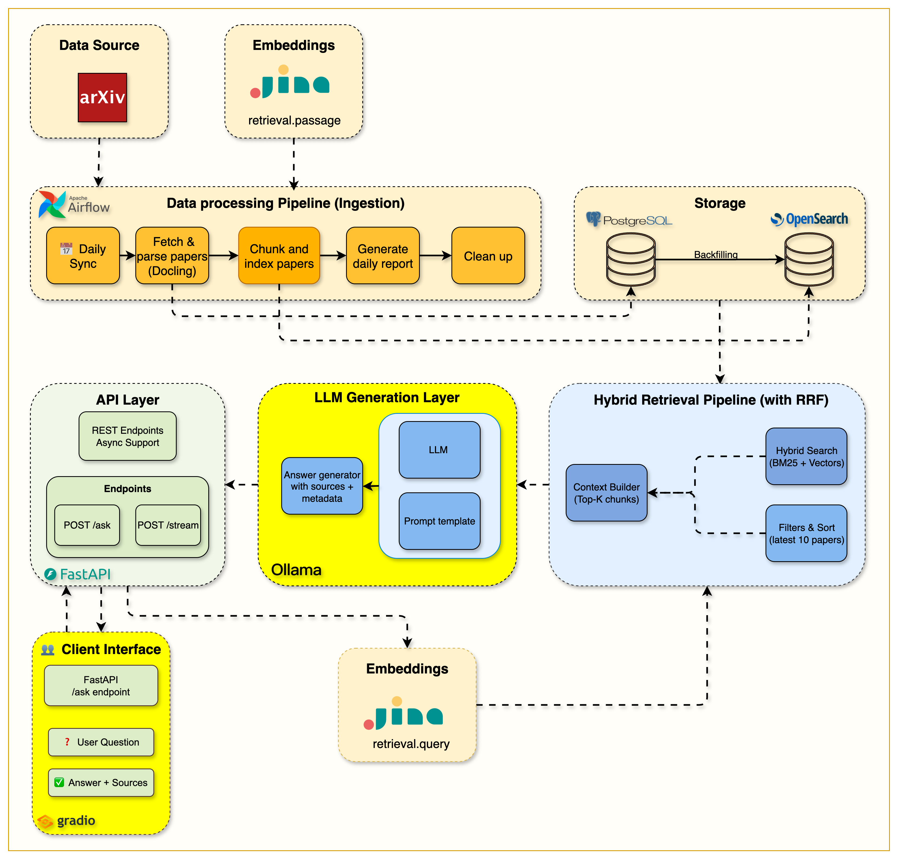

# Week 5 — The Complete RAG Pipeline: Retrieval Meets a Local LLM

> **One-line summary:** Connect hybrid retrieval to a local LLM (Ollama + Llama 3.2) to produce cited answers, through a standard endpoint, a streaming endpoint and a Gradio chat UI, and make it fast by keeping the prompt small.

**Tag:** `week5.0` · **Notebook:** `notebooks/week5/week5_complete_rag_system.ipynb` · **Original blog:** [The Complete RAG System](https://jamwithai.substack.com/p/the-complete-rag-system)



> **Heads-up:** On `main`, `/api/v1/ask` and `/api/v1/stream` also contain Week 6 caching and tracing code, and that tracing code is currently broken (see [Week 6 Gotchas](week6-monitoring-caching.md#gotchas)). To run Week 5 as released: `git checkout week5.0`.

---

## 1. Why this week matters

Weeks 1–4 built a search engine. Week 5 makes it **RAG**: **R**etrieve passages, **A**ugment a prompt with them, **G**enerate an answer grounded in them.

The LLM call is the easy part. The decisions that matter are:

- **What goes into the prompt**, and what stays out. This drives both quality and latency.
- **How long the user waits.** Local LLMs on CPU are slow, so streaming changes how the wait feels.
- **How you keep the model honest**, through grounding instructions and citations.

---

## 2. What you build

| Component | File | Responsibility |
|-----------|------|----------------|
| RAG endpoints | [src/routers/ask.py](../src/routers/ask.py) | `POST /api/v1/ask` (full JSON) and `POST /api/v1/stream` (token stream) |
| Shared retrieval helper | `_prepare_chunks_and_sources()` in [ask.py:19-76](../src/routers/ask.py#L19-L76) | embed → search → minimal chunks + deduplicated source URLs |
| `OllamaClient` | [src/services/ollama/client.py](../src/services/ollama/client.py) | `generate`, `generate_stream`, `generate_rag_answer(_stream)`, health, model list |
| `RAGPromptBuilder` | [src/services/ollama/prompts.py](../src/services/ollama/prompts.py) | Assemble system prompt + context + question |
| System prompt | [src/services/ollama/prompts/rag_system.txt](../src/services/ollama/prompts/rag_system.txt) | Grounding rules, length limit |
| Request/response schemas | [src/schemas/api/ask.py](../src/schemas/api/ask.py) | `AskRequest`, `AskResponse` |
| Gradio UI | [src/gradio_app.py](../src/gradio_app.py), [gradio_launcher.py](../gradio_launcher.py) | Chat UI on port 7861 calling the streaming API |

---

## 3. The request lifecycle

```
POST /api/v1/ask  {"query": "...", "top_k": 3, "use_hybrid": true, "model": "llama3.2:1b", "categories": [...]}
   │
   ├─ 1. embed query (Jina, task=retrieval.query)          ── fails? → BM25 only
   ├─ 2. search_unified(size=top_k)                         ── Week 4 hybrid RRF
   ├─ 3. keep only {arxiv_id, chunk_text} per hit           ── "minimal context"
   │      sources = {https://arxiv.org/pdf/<id>.pdf}        ── deduplicated
   ├─ 4. no chunks? → "I couldn't find any relevant information…"   (no LLM call)
   ├─ 5. prompt = system prompt + numbered chunks + question
   ├─ 6. Ollama /api/generate (temperature 0.7, top_p 0.9)
   └─ 7. AskResponse {query, answer, sources, chunks_used, search_mode}
```

Step 4 is easy to miss: **if retrieval finds nothing, don't call the LLM.** That saves time and removes a common source of hallucinated answers.

---

## 4. Concepts and code walkthrough

### 4.1 Prompt construction: less is faster

`RAGPromptBuilder.create_rag_prompt` ([prompts.py:34-61](../src/services/ollama/prompts.py#L34-L61)):

```
<system prompt from rag_system.txt>

### Context from Papers:

[1. arXiv:2508.12345v1]
<chunk text>

[2. arXiv:2508.67890v2]
<chunk text>

### Question:
<user query>

### Answer:
Provide a natural, conversational response (not JSON) and cite sources using [arXiv:id] format.
```

The README's **"80% prompt reduction / 6× faster (120s → 15–20s)"** comes from this: the first version sent every hit's full metadata (authors, abstract, categories, scores, dates…) along with the chunk. The current version sends only `arxiv_id` + `chunk_text`.

Why this matters so much for a local LLM:

- On CPU, **prompt processing (prefill) time grows with prompt length**, and you pay it before the first token appears.
- Small models (1B–3B parameters) get *worse* with noisy context: they latch onto irrelevant fields.
- Remember that Week 4 chunks already start with title + abstract, so the paper's metadata is in the chunk text anyway.

**Budget math:** `top_k=3` × ~600–800 words per chunk ≈ 2,000–2,500 words ≈ 3,000+ tokens. That's why `top_k` is capped at 10 and why it's the main latency knob:

| Config | Approx. response time (README benchmarks) |
|--------|------------------------------------------|
| `top_k=1`, BM25 | ~2–3 s |
| `top_k=3`, hybrid | ~15–20 s |
| `top_k=5`, hybrid | ~25–30 s |

### 4.2 The system prompt: grounding

[rag_system.txt](../src/services/ollama/prompts/rag_system.txt) tells the model to:

- answer **only** from the excerpts, and say so when they're insufficient,
- cite papers by arXiv ID,
- stay short (word limits),
- skip preambles like "Here's the answer".

These are the basic anti-hallucination tools: *restrict the knowledge source, give it a way to say "I don't know", require citations.*

### 4.3 The Ollama API

[ollama/client.py](../src/services/ollama/client.py) talks to Ollama's REST API at `OLLAMA_HOST` (`http://ollama:11434` inside Docker):

| Endpoint | Used for |
|----------|----------|
| `GET /api/version` | Health check |
| `GET /api/tags` | List installed models |
| `POST /api/generate` (`stream: false`) | One JSON response with `response`, plus metrics |
| `POST /api/generate` (`stream: true`) | **NDJSON** stream: one JSON object per line, `{"response": "tok", "done": false}` … `{"done": true, ...}` |

`generate()` also turns Ollama's metrics into usage metadata for Week 6:
`prompt_eval_count` → prompt tokens, `eval_count` → completion tokens, `total_duration` (nanoseconds) → `latency_ms`. Compare `prompt_eval_duration` with `eval_duration` to see whether prefill or generation is your bottleneck.

**Structured output (optional path).** `create_structured_prompt` + `format=RAGResponse.model_json_schema()` asks Ollama to constrain output to a JSON schema, and `ResponseParser` validates it with Pydantic, with a regex fallback. The endpoints use the **plain-text** path (`use_structured_output=False`) because small models write better prose than JSON, and JSON can't be streamed nicely.

### 4.4 Streaming

`POST /api/v1/stream` ([ask.py:170-273](../src/routers/ask.py#L170-L273)) returns a `StreamingResponse` from an async generator that emits **Server-Sent-Events-style frames**:

```
data: {"sources": [...], "chunks_used": 3, "search_mode": "hybrid"}     ← metadata first

data: {"chunk": "Transformers"}
data: {"chunk": " use"}
data: {"chunk": " self-attention"}
...
data: {"answer": "<full text>", "done": true}                            ← completion signal
```

- **Metadata first**, so the UI can show sources while the answer is still generating.
- **Time to first token ≈ 2–3 s** against ~15–20 s for the full answer. Total time is the same, but the user sees progress straight away.
- Errors inside the generator become a `data: {"error": ...}` frame. Once streaming has started you can't change the HTTP status code.

Test it with `curl --no-buffer` (section 5).

### 4.5 Two endpoints, shared code

`/ask` and `/stream` both call `_prepare_chunks_and_sources` and `RAGPromptBuilder`, so retrieval and prompting behave identically and only delivery differs. Clients choose: batch jobs and integrations use `/ask`, interactive UIs use `/stream`.

### 4.6 Gradio UI

[gradio_app.py](../src/gradio_app.py) is a separate process that calls `http://localhost:8000/api/v1/stream` and renders the tokens as they arrive. Controls: `top_k`, hybrid on/off, model, categories. Launch it with `uv run python gradio_launcher.py` → http://localhost:7861.

The UI is a **client of the API**, not part of it. You could swap Gradio for React, Slack or Telegram (Week 7 does exactly that) without touching the RAG code.

---

## 5. Hands-on

```bash
git checkout week5.0 && docker compose up --build -d

# Pull a model into the Ollama container (first time only)
docker exec rag-ollama ollama pull llama3.2:1b
docker exec rag-ollama ollama list

# Standard RAG
curl -X POST localhost:8000/api/v1/ask -H 'Content-Type: application/json' \
  -d '{"query": "What are the main approaches to reducing LLM hallucination?", "top_k": 3, "use_hybrid": true}'

# Streaming
curl --no-buffer -X POST localhost:8000/api/v1/stream -H 'Content-Type: application/json' \
  -d '{"query": "Explain attention mechanisms", "top_k": 2}'

# UI
uv run python gradio_launcher.py   # → http://localhost:7861
```

**Experiments:**
1. Same question with `top_k` = 1, 3, 5: compare latency and answer quality.
2. Ask something the corpus can't answer ("What's the capital of France?"). Does the model refuse, or answer from its own knowledge?
3. Swap `llama3.2:1b` for `llama3.2:3b` (pull it first): how much better is it, and how much slower?

---

## 6. Design decisions and trade-offs

| Decision | Trade-off |
|----------|-----------|
| Local LLM (Ollama) | Private, free, offline; slow on CPU, and small models follow instructions less reliably than hosted frontier models |
| Minimal context (ID + text only) | Much faster prefill, less noise; the model can't cite titles unless they're in the chunk text (they are, through the Week 4 header) |
| Sources = every retrieved paper | Simple and always populated; lists papers even if the model didn't use them |
| `temperature=0.7` | More natural prose; more variation and more room for drifting from the context. Grounded QA often uses 0–0.3. |
| SSE-style streaming over plain HTTP | Works with `fetch`/`httpx`/curl; one-way only (no cancel signal from the client mid-generation) |

---

<a id="gotchas"></a>

## 7. Gotchas

1. **The system prompt contradicts itself.** It says "LIMIT YOUR RESPONSE TO 300 WORDS" and then "Keep it less than 200 words". It ends with "NEVER add introductory phrases … before your JSON response", while the builder asks for "a natural, conversational response (not JSON)". Small models are sensitive to conflicting instructions. Cleaning this up is a quick quality win.
2. **`search_mode` can be wrong.** `/ask` reports `"hybrid"` whenever `request.use_hybrid` is true ([ask.py:151](../src/routers/ask.py#L151)), even if embedding failed and it fell back to BM25. The `/hybrid-search` router does this correctly by checking `query_embedding`.
3. **Pull the model first.** A fresh Ollama container has no models, and `/ask` fails until you run `ollama pull llama3.2:1b`.
4. **`OLLAMA_TIMEOUT=300`.** Big models or big `top_k` on CPU can genuinely take minutes. Timeouts raise `OllamaTimeoutError`.
5. **`/stream` uses `media_type="text/plain"`**, not `text/event-stream`. Fine for the Gradio client and curl, but browser `EventSource` expects `text/event-stream`.
6. **Citations aren't verified.** Nothing checks that the `[arXiv:id]` tags in the answer match retrieved chunks. A follow-up exercise: parse the cited IDs and drop or flag any that weren't in the context.

---

## 8. Success checklist

- [ ] `docker exec rag-ollama ollama list` shows `llama3.2:1b`
- [ ] `/api/v1/ask` returns an answer with `sources` as arXiv PDF URLs
- [ ] `/api/v1/stream` prints tokens progressively with `curl --no-buffer`
- [ ] An unanswerable query gets a "not enough information" style reply, or a "no relevant information" reply with no LLM call
- [ ] Gradio UI works at http://localhost:7861
- [ ] You've measured latency at `top_k` 1/3/5 yourself

---

## 9. Self-check questions

1. What are the R, A and G steps, and which file does each happen in?
2. Why did removing metadata from the prompt make the system ~6× faster on a local model?
3. Why does `/stream` send `sources` *before* any answer tokens?
4. Why skip the LLM call entirely when retrieval returns no chunks?
5. What's the difference between `prompt_eval_duration` and `eval_duration`, and which one does `top_k` mostly affect?
6. Why is the Gradio app a separate process calling the API instead of importing the RAG code directly?
7. Name three prompt-level techniques that reduce hallucination.

---

## 10. What's next

The system works but you can't see inside it. Which step is slow? What did the model actually see? It also redoes the full 15-second pipeline for a question it answered a minute ago. **Week 6** adds **Langfuse** tracing for every step and a **Redis** cache that answers repeated questions in milliseconds.
