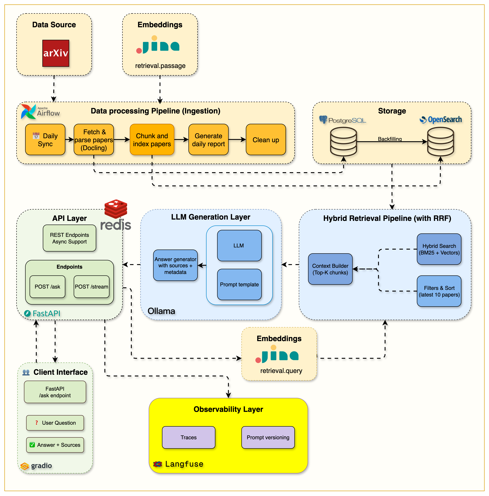

# Week 6 — Production Monitoring and Caching: Langfuse + Redis

> **One-line summary:** Wrap every step of the RAG pipeline in Langfuse traces so you can see latency, prompts and outputs per request, and put a Redis exact-match cache in front so a repeated question returns in ~100 ms instead of ~15 s.

**Tag:** `week6.0` · **Notebook:** `notebooks/week6/week6_cache_testing.ipynb` · **Original blog:** [Production-ready RAG: Monitoring & Caching](https://jamwithai.substack.com/p/production-ready-rag-monitoring-and)



> **Heads-up:** The Week 6 tracing code works at `week6.0` but **breaks on `main`**: the Week 7 commit rewrote `LangfuseTracer` and dropped methods `RAGTracer` still calls. Study and run this week with `git checkout week6.0`. Details in [Gotchas](#gotchas).

---

## 1. Why this week matters

A demo works until someone asks "why was that answer wrong?" or "why did it take 40 seconds?". Without observability you're guessing. And an LLM pipeline is expensive, so recomputing identical answers wastes time and money.

Week 6 adds two production basics:

| Concern | Tool | What you get |
|---------|------|--------------|
| **Observability** | Langfuse (self-hosted, open source) | A trace per request with spans for embedding, search, prompt building and generation, plus the actual prompt and answer for debugging |
| **Performance** | Redis | Exact-match response cache: ~15–20 s → ~50–100 ms on a hit (150–400×) |

Both follow one rule: **they must never break the request.** If tracing or caching fails, the user still gets an answer.

---

## 2. What you build

| Component | File | Responsibility |
|-----------|------|----------------|
| `LangfuseTracer` | [src/services/langfuse/client.py](../src/services/langfuse/client.py) | Wraps the Langfuse SDK; no-ops when disabled |
| `RAGTracer` | [src/services/langfuse/tracer.py](../src/services/langfuse/tracer.py) | RAG-specific context managers: `trace_request`, `trace_embedding`, `trace_search`, `trace_prompt_construction`, `trace_generation` |
| `CacheClient` | [src/services/cache/client.py](../src/services/cache/client.py) | `find_cached_response`, `store_response` |
| Redis factory | [src/services/cache/factory.py](../src/services/cache/factory.py) | Connection with timeouts and retry-on-error |
| Updated endpoints | [src/routers/ask.py](../src/routers/ask.py) | Cache check → traced pipeline → cache store |
| Compose services | [compose.yml](../compose.yml) | `redis`, plus the Langfuse v3 stack: `langfuse-web`, `langfuse-worker`, `langfuse-postgres`, `langfuse-redis`, `langfuse-minio`, `clickhouse` |

---

## 3. The new request flow

```
POST /api/v1/ask
  │
  ├─ trace_request(user_id, query)  ─────────────────────────── Langfuse trace (root)
  │    │
  │    ├─ cache.find_cached_response(request)
  │    │     HIT  → return cached AskResponse            (~50–100 ms)
  │    │     MISS ↓
  │    ├─ span "query_embedding"      {query_length, embedding_duration_ms}
  │    ├─ span "search_retrieval"     {top_k → chunks_returned, unique_papers, arxiv_ids}
  │    ├─ span "prompt_construction"  {chunk_count → prompt_length, prompt_preview}
  │    ├─ span "llm_generation"       {model, prompt → response, response_length}
  │    ├─ trace.update(answer, total_duration_seconds)
  │    └─ cache.store_response(request, response)    (TTL)
  │
  └─ flush traces
```

---

## 4. Caching with Redis

### 4.1 The cache key

[cache/client.py:22-33](../src/services/cache/client.py#L22-L33):

```python
key_data = {
    "query":      request.query,
    "model":      request.model,
    "top_k":      request.top_k,
    "use_hybrid": request.use_hybrid,
    "categories": sorted(request.categories) if request.categories else [],
}
key_string = json.dumps(key_data, sort_keys=True)
key = "exact_cache:" + sha256(key_string).hexdigest()[:16]
```

Details that matter:

- **Every parameter that changes the answer is in the key.** The same question with `top_k=5` or a different model is a different answer, so it gets a different key. Forget one and users get answers computed with someone else's settings.
- **Canonicalization:** `sorted(categories)` and `sort_keys=True`, so `["cs.LG","cs.AI"]` and `["cs.AI","cs.LG"]` hit the same entry.
- **Hashing** gives fixed-length keys whatever the query length. 16 hex chars = 64 bits, so collisions are negligible at this scale.
- **Namespace prefix** `exact_cache:` lets you find or flush all cache keys (`SCAN 0 MATCH exact_cache:*`).

### 4.2 TTL and staleness

`redis.set(key, response.model_dump_json(), ex=ttl)` with `REDIS__TTL_HOURS` (6 in `.env.example` and `config.py`; the notebook README says 24).

TTL is your **staleness budget**. New papers arrive every weekday, so a cached answer to "latest work on X" can miss today's papers until it expires. Shorter TTL means fresher answers and fewer hits. Another option is invalidating on ingestion (flush `exact_cache:*` when the DAG finishes).

### 4.3 Exact vs semantic caching

| | Exact match (this week) | Semantic cache (future) |
|-|-------------------------|-------------------------|
| Hit condition | Identical query string + params | Query embedding within a similarity threshold of a cached one |
| "What is RAG?" vs "what is RAG?" | **Miss** (case differs) | Hit |
| Risk of wrong answer | None | False hits: "pros of X" vs "cons of X" can be very close in embedding space |
| Cost per lookup | One `GET`, O(1) | An embedding call + vector search |

Start with exact match because it's simple and never wrong. A cheap improvement is to normalize the query before hashing (lowercase, trim, collapse whitespace).

### 4.4 Graceful degradation

```python
if cache_client:
    try:
        cached = await cache_client.find_cached_response(request)
        if cached: return cached
    except Exception as e:
        logger.warning(f"Cache check failed, proceeding with normal flow: {e}")
```

Inside `CacheClient`, every Redis error is caught and returns `None`/`False`. A dead cache costs speed, not availability.

### 4.5 Streaming and the cache

On a hit, `/stream` **replays** the cached answer: metadata frame, then the answer split into words as `chunk` frames, then `done`. The client code is the same for hits and misses.

---

## 5. Observability with Langfuse

### 5.1 Traces, spans, generations

- **Trace** = one user request (root).
- **Span** = a timed step inside it (embedding, search, prompt building).
- **Generation** = a span specific to LLM calls (model, prompt, completion, token usage).

In the Langfuse UI each request appears as a timeline, so you can see at a glance that, say, 1.8 s went to the Jina call and 14 s to generation.

### 5.2 The `RAGTracer` pattern

[tracer.py](../src/services/langfuse/tracer.py) wraps each step in a **context manager**:

```python
with rag_tracer.trace_search(trace, request.query, request.top_k) as search_span:
    results = opensearch_client.search_unified(...)
    rag_tracer.end_search(search_span, chunks, arxiv_ids, results["total"])
```

- Timing and `span.end()` live in `finally`, so a span closes even if the step throws.
- Every helper checks `if span:` / `if not trace: return`. When Langfuse is disabled the wrappers are no-ops, and the business code doesn't contain a single `if langfuse_enabled`.
- Only useful data is logged: counts, IDs, lengths, and the full prompt **once** (in `llm_generation`, with a preview in `prompt_construction`).

### 5.3 What to look at in the dashboard

1. **Latency breakdown** per span. Is it retrieval, embedding or generation?
2. **The exact prompt** for a bad answer. Did retrieval bring the right chunks? Usually it didn't, and that's a retrieval bug, not an LLM bug.
3. **Token usage** per generation (from Ollama's `prompt_eval_count` / `eval_count`).
4. **Trends:** p50/p95 latency over time, error rate, most frequent queries (good candidates for the cache).

### 5.4 Setup

```bash
docker compose up --build -d          # starts the Langfuse stack as well
open http://localhost:3001            # Langfuse UI (host port 3001 → container 3000)
# create an account → project → API keys, then put them in .env:
LANGFUSE__PUBLIC_KEY=pk-lf-...
LANGFUSE__SECRET_KEY=sk-lf-...
LANGFUSE__HOST=http://langfuse-web:3000   # from inside Docker
docker compose restart api
```

Note the **double underscore**; see Gotcha 2.

---

## 6. Hands-on

```bash
git checkout week6.0 && docker compose up --build -d

# Miss, then hit: compare the timings
time curl -s -X POST localhost:8000/api/v1/ask -H 'Content-Type: application/json' \
  -d '{"query": "What are transformers?", "top_k": 3}' > /dev/null
time curl -s -X POST localhost:8000/api/v1/ask -H 'Content-Type: application/json' \
  -d '{"query": "What are transformers?", "top_k": 3}' > /dev/null

# Same question, different params → miss again
time curl -s -X POST localhost:8000/api/v1/ask -H 'Content-Type: application/json' \
  -d '{"query": "What are transformers?", "top_k": 4}' > /dev/null

# Look inside Redis
docker exec rag-redis redis-cli --scan --pattern 'exact_cache:*'
docker exec rag-redis redis-cli TTL <one-of-the-keys>

# Kill Redis: the API should still answer (slowly)
docker stop rag-redis
curl -X POST localhost:8000/api/v1/ask -H 'Content-Type: application/json' -d '{"query": "What is RLHF?"}'
docker start rag-redis
```

Then open the Langfuse UI, find the three traces, and compare their span timings.

---

## 7. Design decisions and trade-offs

| Decision | Trade-off |
|----------|-----------|
| Cache the **final response** (not embeddings or search results) | Biggest win per hit; any parameter change is a full miss. Caching query embeddings separately would also speed up misses. |
| Exact-match keys | Zero false hits; low hit rate for paraphrases |
| TTL-based expiry | Simple; answers can be stale for up to a TTL after new papers arrive |
| Self-hosted Langfuse | Data stays local, free; adds 6 containers (ClickHouse, MinIO, …) and RAM |
| Log full prompts and answers | Easy to debug; consider PII and data retention in a real deployment |

---

<a id="gotchas"></a>

## 8. Gotchas

1. **🔴 `/ask` and `/stream` crash on `main`.** `RAGTracer.trace_request` calls `self.tracer.trace_rag_request(...)` ([tracer.py:21](../src/services/langfuse/tracer.py#L21)) and the other helpers call `self.tracer.create_span(...)`. Those methods existed at `week6.0`, but the Week 7 commit (`99aeed6`) rewrote `LangfuseTracer` for the Langfuse v3 SDK and **removed them**. The `try/finally` in `trace_request` doesn't catch the `AttributeError`, so both endpoints fail with 500 (streaming sends an `error` frame), whether or not Langfuse is enabled.
   **Fix options:** restore `trace_rag_request`, `create_span` and `end_span` on `LangfuseTracer` as v3 wrappers (e.g. on top of `start_as_current_span`), or make `RAGTracer` use the new `start_span`/`update_span` API. The branch `origin/feature/deepseek-ocr-integration` still has the old methods, which helps as a reference.
2. **🟠 Langfuse keys are silently ignored.** `.env.example` uses `LANGFUSE_PUBLIC_KEY`, `LANGFUSE_SECRET_KEY` and `LANGFUSE_HOST` (single underscore), but `LangfuseSettings` reads the prefix **`LANGFUSE__`** ([config.py:108](../src/config.py#L108)). With the example file copied as-is, keys are empty and the log says "Langfuse tracing disabled or missing credentials". Rename to `LANGFUSE__PUBLIC_KEY`, etc. (The `compose.yml` `LANGFUSE_HOST` env var has the same problem.)
3. **The Langfuse UI is on port 3001**, not 3000 as the top-level README says (`"3001:3000"` in `compose.yml`).
4. **Redis down at startup = API down.** `make_redis_client` pings and **raises** if Redis is unreachable, and `main.py` doesn't catch it. The *runtime* degradation is graceful but startup isn't. Wrapping `make_cache_client` in `try/except` and setting `app.state.cache_client = None` would fix it (the `CacheDep` type is already `CacheClient | None`).
5. **Sync Redis inside async code.** `CacheClient` uses the synchronous `redis.Redis` inside `async def` methods, so each call briefly blocks the event loop. `redis.asyncio.Redis` is the drop-in fix.
6. **Case and whitespace break the cache.** `"What is RAG?"` and `"what is rag? "` are different keys.

---

## 9. Success checklist

- [ ] The second identical `/ask` request is under 200 ms; changing `top_k` causes a miss
- [ ] `redis-cli --scan --pattern 'exact_cache:*'` shows keys with a positive TTL
- [ ] Stopping Redis mid-run doesn't break `/ask`
- [ ] Langfuse shows one trace per request with the four spans and their timings
- [ ] You can find the full prompt of a specific request in Langfuse
- [ ] (On `main`) you've fixed or worked around Gotchas 1–2

---

## 10. Self-check questions

1. Why must `model`, `top_k`, `use_hybrid` and `categories` be part of the cache key?
2. Why sort `categories` and use `sort_keys=True` before hashing?
3. What does TTL trade off in a system that ingests new papers every day?
4. Give an example where a semantic cache would return a *wrong* answer.
5. What's the difference between a trace, a span and a generation in Langfuse?
6. Why do the tracing helpers close spans in `finally`?
7. A user reports a bad answer. Which spans would you check first, and what would you look for?

---

## 11. What's next

The pipeline is fast and observable but always does the same thing: retrieve once, generate once, whether the question is on-topic or not, and whether the retrieved chunks are relevant or not. **Week 7** turns it into an **agent** with LangGraph: it validates the question, grades what it retrieved, rewrites the query when retrieval misses, and answers through a Telegram bot.
