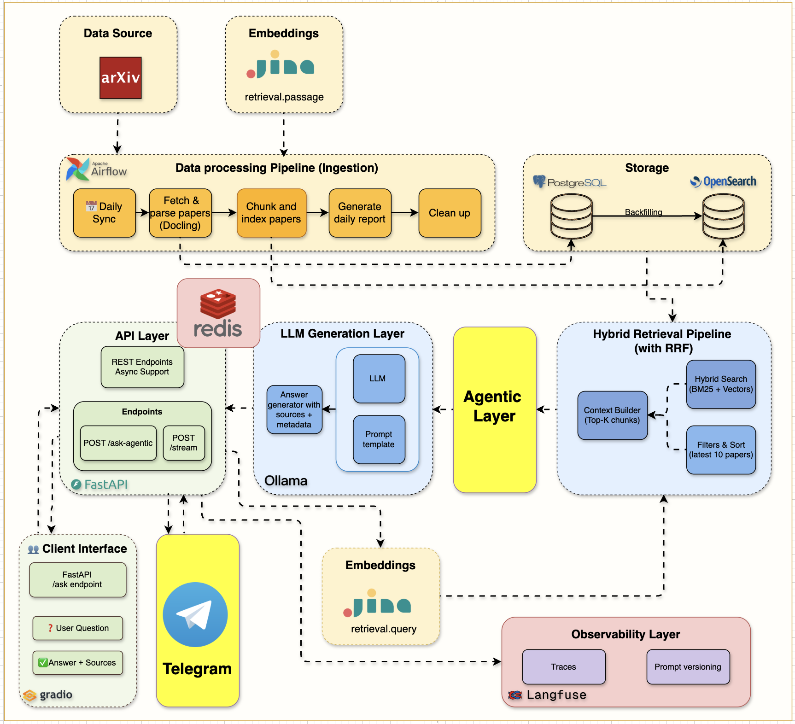

# Week 7 — Agentic RAG with LangGraph, plus a Telegram Bot

> **One-line summary:** Replace "always retrieve once, then generate" with a LangGraph state machine that **validates** the question, **retrieves**, **grades** what it found, **rewrites** the query and retries if needed, then answers. Add a Telegram bot as a second front-end.

**Tag:** `week7.0` · **Notebook:** `notebooks/week7/week7_agentic_rag.ipynb` · **Original blog:** [Agentic RAG with LangGraph and Telegram](https://jamwithai.substack.com/p/agentic-rag-with-langgraph-and-telegram)



> **Heads-up:** The notebook README describes a slightly different design from the code (a `generate_query_or_respond` node that answers simple questions directly, Telegram `/settings` keyboards, a `user_manager`). These notes describe **what the code actually does**. Also read [Gotchas](#gotchas) before running: on `main` the agent's LLM calls fail and every query ends up "out of scope".

---

## 1. Why this week matters

The Week 5–6 pipeline is a fixed line: `retrieve → generate`. That has three failure modes:

| Failure | Example | Traditional RAG | Agentic RAG |
|---------|---------|-----------------|-------------|
| Off-topic question | "What's a good pasta recipe?" | Retrieves random CS papers and makes something up from them | **Guardrail** rejects it politely |
| Retrieval misses | "Tell me about ML stuff" | Answers from irrelevant chunks | **Grader** notices, **rewriter** reformulates, retrieves again |
| No good evidence at all | Topic not in the corpus | Confident but wrong answer | Gives up after N attempts with an honest message |

"Agentic" here means **the pipeline makes decisions at runtime based on intermediate results**. It isn't an open-ended autonomous agent. It's a small, explicit **state machine** whose branch points are LLM judgments. Most production "agents" look like this.

---

## 2. What you build

| Component | File | Responsibility |
|-----------|------|----------------|
| `AgenticRAGService` | [src/services/agents/agentic_rag.py](../src/services/agents/agentic_rag.py) | Builds and compiles the graph; `ask()` runs it, wraps it in a Langfuse trace, extracts results |
| State | [src/services/agents/state.py](../src/services/agents/state.py) | `AgentState` TypedDict: what changes as the graph runs |
| Context | [src/services/agents/context.py](../src/services/agents/context.py) | `Context` dataclass: dependencies and settings that *don't* change |
| Config | [src/services/agents/config.py](../src/services/agents/config.py) | `GraphConfig`: `max_retrieval_attempts=2`, `guardrail_threshold=60`, `model`, `top_k=3`, … |
| Nodes | [src/services/agents/nodes/](../src/services/agents/nodes/) | `guardrail`, `out_of_scope`, `retrieve`, `grade_documents`, `rewrite_query`, `generate_answer` |
| Tool | [src/services/agents/tools.py](../src/services/agents/tools.py) | `retrieve_papers`: a LangChain `@tool` wrapping Jina + OpenSearch hybrid search |
| Structured outputs | [src/services/agents/models.py](../src/services/agents/models.py) | `GuardrailScoring`, `GradeDocuments`, `SourceItem`, … |
| Prompts | [src/services/agents/prompts.py](../src/services/agents/prompts.py) | `GUARDRAIL_PROMPT`, `GRADE_DOCUMENTS_PROMPT`, `REWRITE_PROMPT`, `GENERATE_ANSWER_PROMPT` |
| API | [src/routers/agentic_ask.py](../src/routers/agentic_ask.py) | `POST /api/v1/ask-agentic`, `POST /api/v1/feedback` |
| Telegram bot | [src/services/telegram/bot.py](../src/services/telegram/bot.py), [factory.py](../src/services/telegram/factory.py) | Polling bot started in the FastAPI `lifespan` |
| Diagram | [static/langgraph-mermaid.png](../static/langgraph-mermaid.png) | The compiled graph |

---

## 3. The graph

Built in `_build_graph()` ([agentic_rag.py:75-160](../src/services/agents/agentic_rag.py#L75-L160)):

```
              START
                │
           ┌────▼─────┐   score < 60   ┌──────────────┐
           │ guardrail ├───────────────►│ out_of_scope ├──► END
           └────┬─────┘                 └──────────────┘
                │ score ≥ 60
           ┌────▼─────┐   attempts ≥ max (AIMessage, no tool call)
     ┌────►│ retrieve ├──────────────────────────────────────────► END
     │     └────┬─────┘
     │          │ AIMessage with tool_call "retrieve_papers"   (tools_condition)
     │    ┌─────▼────────┐
     │    │ tool_retrieve│   ToolNode → runs retrieve_papers → ToolMessage
     │    └─────┬────────┘
     │    ┌─────▼──────────┐  relevant   ┌─────────────────┐
     │    │ grade_documents├────────────►│ generate_answer ├──► END
     │    └─────┬──────────┘             └─────────────────┘
     │          │ not relevant
     │    ┌─────▼────────┐
     └────┤ rewrite_query│   new HumanMessage with the improved query
          └──────────────┘
```

Node by node:

| Node | Uses LLM? | Reads | Writes | Fallback if the LLM call fails |
|------|-----------|-------|--------|---------------------------------|
| `guardrail` | Yes, structured output `GuardrailScoring{score 0–100, reason}` | latest `HumanMessage` | `guardrail_result` | score = 50 |
| `continue_after_guardrail` (edge fn) | No | `guardrail_result`, `context.guardrail_threshold` | route | missing result → continue |
| `out_of_scope` | No (template) | query | final `AIMessage` | — |
| `retrieve` | **No.** It builds a tool call deterministically. | `retrieval_attempts` | `retrieval_attempts+1`, `original_query`, `AIMessage(tool_calls=[retrieve_papers(query)])`, or a give-up message | — |
| `tool_retrieve` | No (`ToolNode`) | the tool call | `ToolMessage` with the documents | — |
| `grade_documents` | Yes, structured output `GradeDocuments{binary_score yes/no, reasoning}` | latest query + latest `ToolMessage` | `routing_decision`, `grading_results` | relevant if context > 50 chars |
| `rewrite_query` | Yes, structured output `QueryRewriteOutput`, temperature 0.3 | `original_query` | new `HumanMessage(rewritten)`, `rewritten_query` | append "research paper arxiv machine learning" |
| `generate_answer` | Yes, free text | latest query + latest `ToolMessage` | final `AIMessage` | apology with the error |

---

## 4. Concepts

### 4.1 State vs Context: two kinds of data

```python
class AgentState(TypedDict):                         # changes as the graph runs
    messages: Annotated[list[AnyMessage], add_messages]
    original_query: Optional[str]
    rewritten_query: Optional[str]
    retrieval_attempts: int
    guardrail_result: Optional[GuardrailScoring]
    routing_decision: Optional[str]
    grading_results: List[GradingResult]
    ...

@dataclass
class Context:                                        # fixed for the whole run
    ollama_client, opensearch_client, embeddings_client, langfuse_tracer, trace
    model_name="llama3.2:1b", temperature=0.0, top_k=3,
    max_retrieval_attempts=2, guardrail_threshold=60
```

- **State** is what nodes read and write. Each node returns a **partial update** (a dict with only the keys it changes) and LangGraph merges it in.
- **Reducers:** `messages` is annotated with `add_messages`, so returning `{"messages": [msg]}` **appends** instead of overwriting. Every other key is last-write-wins.
- **Context** holds dependencies (clients) and settings, passed through `StateGraph(AgentState, context_schema=Context)` and `graph.ainvoke(state, context=runtime_context)`. Nodes access it as `runtime.context.ollama_client`.

This is **dependency injection for graphs**, the same idea as FastAPI's `Depends` in Week 3. Nodes become plain functions you can unit-test with a fake `Context`, and no client objects end up in the state, where they'd be copied around and shouldn't be serialized.

### 4.2 The message list is the working memory

Nodes talk to each other mainly through `messages`:

```
HumanMessage("Tell me about ML stuff")                 ← user
AIMessage(tool_calls=[retrieve_papers("Tell me…")])    ← retrieve
ToolMessage("<chunks…>")                               ← tool_retrieve
HumanMessage("What are recent advances in …?")         ← rewrite_query
AIMessage(tool_calls=[retrieve_papers("What are…")])   ← retrieve (attempt 2)
ToolMessage("<better chunks…>")                        ← tool_retrieve
AIMessage("Recent advances include …")                 ← generate_answer
```

Helpers in [nodes/utils.py](../src/services/agents/nodes/utils.py): `get_latest_query()` returns the **last `HumanMessage`** (so after a rewrite every node automatically uses the new query) and `get_latest_context()` returns the **last `ToolMessage`**. The final answer is `messages[-1]`.

### 4.3 A deterministic tool call

Usually an LLM decides whether to call a tool. Here the `retrieve` node **builds the tool call itself**:

```python
AIMessage(content="", tool_calls=[{"id": f"retrieve_{n}", "name": "retrieve_papers", "args": {"query": question}}])
```

It still uses LangGraph's prebuilt pieces (`ToolNode` runs the tool, `tools_condition` routes "has tool calls → tools, else END"), but without trusting a 1B model to emit valid tool-call JSON. Small models are unreliable at tool calling, so making the predictable steps deterministic and keeping the LLM for **judgments** (in scope? relevant? better phrasing?) is a good pattern.

The `END` branch of `tools_condition` doubles as the **loop breaker**: once `retrieval_attempts >= max_retrieval_attempts`, `retrieve` returns a plain `AIMessage` with no tool call, and the graph ends with an honest "couldn't find relevant papers" message.

### 4.4 Structured output for decisions

```python
structured_llm = llm.with_structured_output(GuardrailScoring)
response = await structured_llm.ainvoke(GUARDRAIL_PROMPT.format(question=query))
# response.score: int 0–100, response.reason: str
```

Routing needs **machine-readable** decisions. Pydantic models give type checks and value ranges (`score: int = Field(ge=0, le=100)`, `binary_score: Literal["yes","no"]`). Every structured call has a **fallback** for when the model returns garbage.

Why a 0–100 guardrail score instead of yes/no? The threshold (60) becomes a **tunable** knob, and the score is logged, so you can look at borderline cases in Langfuse and move the threshold.

### 4.5 Bounded loops

`max_retrieval_attempts=2`: at most initial retrieval + one rewrite. Every agent loop needs a hard bound, or a bad grader can loop forever and burn tokens. Worst case on a local model: guardrail + 2 × (retrieve + grade) + rewrite + generate = **6 LLM calls**, against 1 in Week 5. That's the cost of being agentic.

### 4.6 Tracing an agent (Langfuse v3)

`ask()` opens a root span with `langfuse.start_as_current_span("agentic_rag_request")` and passes a Langfuse `CallbackHandler()` in the LangGraph `config["callbacks"]`. The handler **inherits the current span from context**, so every LangChain LLM call inside the graph is recorded under the request trace automatically. Each node also tries to add its own span (`guardrail_validation`, `document_grading`, `query_rewriting`, `answer_generation`) with decision details such as score, routing and reasoning.

The `/api/v1/feedback` endpoint is meant to attach a user rating to a trace (`trace_id` + `score` in −1..1), the start of a feedback loop for evaluation.

### 4.7 The Telegram bot

[telegram/bot.py](../src/services/telegram/bot.py) uses `python-telegram-bot` v21 in **polling** mode:

- Started inside FastAPI's `lifespan` (`await telegram_service.start()`) and stopped on shutdown, so it shares the process and clients (OpenSearch, Jina, Ollama, Redis) with the API.
- Handlers: `/start`, `/help`, `/search <keywords>` (hybrid search, deduplicated to 5 unique papers, arXiv `abs` links), and **any text message** → RAG answer.
- The question path is the **classic Week 5 pipeline** plus the Week 6 cache (same `AskRequest`-based key), *not* the agentic graph. Answers go out as Markdown, with a plain-text fallback if Telegram rejects the formatting.
- Enabled via `TELEGRAM__ENABLED=true` + `TELEGRAM__BOT_TOKEN=...` (from @BotFather). If either is missing, the factory returns `None` and the API starts without the bot.

**Polling vs webhook:** polling (the bot asks Telegram "anything new?") works behind NAT on a laptop, with no public URL. Webhooks (Telegram pushes updates to your HTTPS endpoint) are better in production: lower latency, they scale horizontally, and no long-lived poller.

---

## 5. Hands-on

```bash
git checkout week7.0 && docker compose up --build -d   # or main, after the fixes in Gotchas
docker exec rag-ollama ollama pull llama3.2:1b

# Expected: rejected by guardrail
curl -X POST localhost:8000/api/v1/ask-agentic -H 'Content-Type: application/json' \
  -d '{"query": "What is a good pasta recipe?"}'

# Expected: guardrail → retrieve → grade (relevant) → generate
curl -X POST localhost:8000/api/v1/ask-agentic -H 'Content-Type: application/json' \
  -d '{"query": "How do retrieval-augmented generation systems reduce hallucination?"}'

# Expected (sometimes): grade fails → rewrite → retrieve again
curl -X POST localhost:8000/api/v1/ask-agentic -H 'Content-Type: application/json' \
  -d '{"query": "tell me about ML stuff"}'
```

Inspect `reasoning_steps` and `retrieval_attempts` in each response, then open the trace in Langfuse (http://localhost:3001) to see each node's decision.

**See the graph:**
```python
print(service.get_graph_mermaid())     # paste into https://mermaid.live
```

**Telegram:** create a bot with @BotFather → set `TELEGRAM__ENABLED=true` and `TELEGRAM__BOT_TOKEN` in `.env` → `docker compose restart api` → `docker compose logs -f api | grep -i telegram` → message your bot.

---

## 6. Design decisions and trade-offs

| Decision | Trade-off |
|----------|-----------|
| Explicit state machine (LangGraph) instead of a free-form ReAct agent | Predictable, debuggable, bounded cost; less flexible |
| Deterministic tool call in `retrieve` | Works with tiny models; the agent can't choose *other* tools or skip retrieval |
| One binary grade over **all** retrieved chunks together | 1 LLM call instead of `top_k`; one bad chunk among good ones isn't filtered out, and one good chunk among bad ones can get everything rejected |
| Guardrail before retrieval | Saves retrieval and generation on junk; one extra LLM call (latency) on every request, and false rejections of borderline questions |
| Same small model for every role | Simple; grading and guardrail quality are limited by a 1B model. A common pattern is a small fast model for routing and a stronger one for the final answer. |
| Telegram uses classic RAG, not the agent | Faster replies and cache-friendly; no guardrail on the bot |

---

<a id="gotchas"></a>

## 7. Gotchas

These come from reading the code on `main` (= `week7.0` + later fixes).

1. **🔴 Every LLM node fails, so every query ends up "out of scope".** All four LLM nodes call `runtime.context.ollama_client.get_langchain_model(...)` (e.g. [guardrail_node.py:84](../src/services/agents/nodes/guardrail_node.py#L84)), but **`OllamaClient` has no such method**, here or at any tag. Each node catches the `AttributeError` and uses its fallback. For the guardrail that's `score=50` ([guardrail_node.py:119](../src/services/agents/nodes/guardrail_node.py#L119)), which is **below the threshold of 60**, so the graph always routes to `out_of_scope`.
   **Fix:** add the method using `langchain-ollama` (already in `pyproject.toml`):
   ```python
   # src/services/ollama/client.py
   from langchain_ollama import ChatOllama

   def get_langchain_model(self, model: str, temperature: float = 0.0) -> ChatOllama:
       return ChatOllama(base_url=self.base_url, model=model, temperature=temperature)
   ```
   Also consider whether the guardrail's *failure* fallback should really reject: an infrastructure error currently looks like "your question is off-topic" to the user.
2. **Node-level Langfuse spans are silently skipped.** Nodes call `langfuse_tracer.create_span(...)` / `end_span(...)`, which don't exist on the v3 `LangfuseTracer` (same root cause as [Week 6 Gotcha 1](week6-monitoring-caching.md#gotchas)). It's wrapped in `try`, so it only logs a warning. You still get LLM-call traces from the `CallbackHandler`, but not the decision spans.
3. **`sources` is always empty.** `_extract_sources` reads `state["relevant_sources"]`, which no node ever writes. `chunks_used` echoes `request.top_k` instead of a real count. Populating `relevant_sources` from the tool's `Document.metadata` in `grade_documents` is a good exercise.
4. **Request params are ignored.** `/ask-agentic` calls `agentic_rag.ask(query=request.query)` only, so `top_k`, `use_hybrid`, `model` and `categories` from the request have no effect (the `GraphConfig` defaults are used).
5. **`trace_id` is never returned** (the result dict has no `trace_id` key), so the client can't call `/feedback`. And `submit_feedback` uses `client.score(...)`, which is the v2 SDK name; v3 uses `create_score(...)`. Check this against your installed version.
6. **No direct-answer path.** The notebook README says "What is 2+2?" gets answered directly. In the code it's rejected by the guardrail. `DECISION_PROMPT`, `DIRECT_RESPONSE_PROMPT` and `SYSTEM_MESSAGE` in `prompts.py` are unused leftovers of that design.
7. **Telegram README vs code.** `/ask`, `/settings`, `/status`, `/clear`, inline keyboards, per-user settings, rate limiting, `handlers.py`/`formatters.py`/`user_manager.py`: none of these exist. The bot is ~230 lines in `bot.py`. Long answers aren't split (Telegram limit: 4096 chars), and the model is hard-coded to `llama3.2:1b`.
8. **`tool_retrieve` returns `list[Document]`**, which `ToolNode` turns into one **string** in the `ToolMessage`. The grader and generator see that string: chunk text plus Python reprs of the metadata. It works, but formatting the documents explicitly (`[1] title (arXiv:id)\n<text>`) would give the LLM cleaner context and make citations easier.

---

## 8. Success checklist

- [ ] (On `main`) `get_langchain_model` implemented; on-topic questions no longer return the out-of-scope message
- [ ] An off-topic query gets the out-of-scope message, with a guardrail score < 60 in `reasoning_steps`
- [ ] An on-topic query shows `Retrieved documents (1 attempt(s))` → `Graded documents (1 relevant)`
- [ ] You've triggered a rewrite (`Rewritten query for better results`, `retrieval_attempts: 2`)
- [ ] You've triggered the give-up path (a topic not in your corpus)
- [ ] The graph renders via `get_graph_mermaid()`
- [ ] Telegram bot answers `/start`, `/search transformers` and a free-text question; asking the same question again is instant (cache)

---

## 9. Self-check questions

1. What's the difference between `AgentState` and `Context`? Why keep clients out of the state?
2. What does the `add_messages` reducer do, and what would break without it?
3. After `rewrite_query` runs, how does the `retrieve` node know to use the new query?
4. Why does `retrieve` build the tool call itself instead of letting the LLM decide?
5. How does the graph avoid an infinite rewrite loop? Trace the exact path when attempts run out.
6. Count the LLM calls for (a) an off-topic query, (b) a query relevant on the first try, (c) a query that needs one rewrite.
7. Why a 0–100 guardrail score and a threshold, instead of a yes/no?
8. Polling vs webhook for a Telegram bot: when would you use each?

---

## 10. Where to go from here

You now have the full stack: ingestion → hybrid retrieval → generation → caching → tracing → agentic control → two front-ends. Good next steps:

- **Evaluation:** build a set of 30–50 questions with expected papers; measure retrieval recall@k and answer faithfulness (an LLM judge, or RAGAS-style metrics). Without this you can't tell whether a change helped.
- **Per-chunk grading:** grade each retrieved chunk, keep the relevant ones, and populate `relevant_sources` (fixes Gotcha 3).
- **Model routing:** small model for guardrail and grading, larger one for the final answer.
- **Semantic cache** (Week 6 follow-up) and cache invalidation on ingestion.
- **Conversation memory** for Telegram: pass previous turns as `messages`, with a LangGraph checkpointer keyed by `thread_id`.
- **Deployment:** webhook mode, secrets management, and the remaining phases of the Mother of AI roadmap (MLOps/LLMOps, monitoring and alerting).
